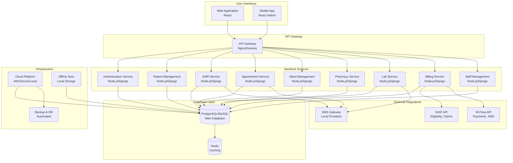

# System Architecture Diagram

```mermaid
graph TB
    subgraph "User Interfaces"
        Web[Web Application<br/>React]
        Mobile[Mobile App<br/>React Native]
    end

    subgraph "API Gateway"
        Gateway[API Gateway<br/>Nginx/Express]
    end

    subgraph "Backend Services"
        Auth[Authentication Service<br/>Node.js/Django]
        Patient[Patient Management<br/>Node.js/Django]
        EMR[EMR Service<br/>Node.js/Django]
        Appointment[Appointment Service<br/>Node.js/Django]
        Ward[Ward Management<br/>Node.js/Django]
        Pharmacy[Pharmacy Service<br/>Node.js/Django]
        Lab[Lab Service<br/>Node.js/Django]
        Billing[Billing Service<br/>Node.js/Django]
        Staff[Staff Management<br/>Node.js/Django]
    end

    subgraph "External Integrations"
        NHIF[NHIF API<br/>Eligibility, Claims]
        MPesa[M-Pesa API<br/>Payments, SMS]
        SMS[SMS Gateway<br/>Local Providers]
    end

    subgraph "Database Layer"
        DB[(PostgreSQL/MySQL<br/>Main Database)]
        Cache[(Redis<br/>Caching)]
    end

    subgraph "Infrastructure"
        Cloud[Cloud Platform<br/>AWS/Azure/Local]
        Backup[Backup & DR<br/>Automated]
        Offline[Offline Sync<br/>Local Storage]
    end

    Web --> Gateway
    Mobile --> Gateway
    Gateway --> Auth
    Gateway --> Patient
    Gateway --> EMR
    Gateway --> Appointment
    Gateway --> Ward
    Gateway --> Pharmacy
    Gateway --> Lab
    Gateway --> Billing
    Gateway --> Staff

    Auth --> DB
    Patient --> DB
    EMR --> DB
    Appointment --> DB
    Ward --> DB
    Pharmacy --> DB
    Lab --> DB
    Billing --> DB
    Staff --> DB

    Billing --> NHIF
    Billing --> MPesa
    EMR --> SMS
    Appointment --> SMS
    Lab --> SMS

    DB --> Cache
    Cloud --> DB
    Cloud --> Backup
    Offline --> DB
```